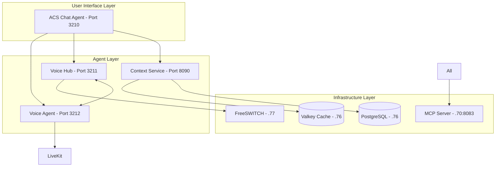

# ACS Orchestrator - Master Control System

## 🏗️ Complete System Architecture



## 📦 Repository Map

| Repository | Purpose | Port | Server |
|------------|---------|------|--------|
| **acs-orchestrator** | Master control & docs | - | GitHub only |
| **acs-chat-hub** | Main UI portal | 3210 | 10.152.0.71 |
| **agent-acs-voice-hub** | FreeSWITCH control | 3211 | 10.152.0.71 |
| **agent-acs-voice-agent** | AI voice processing | 3212 | 10.152.0.71 |
| **agent-acs-context** | Memory management | 8090 | 10.152.0.70 |
| **agent-acs-agent** | General assistant | - | 10.152.0.70 |
| **agent-acs-voice** | Voice expert | - | 10.152.0.70 |
| **agent-acs-voice-assistant** | IVR specialist | - | 10.152.0.70 |

## 🧠 Context Management System

### Hierarchy
1. **System Context** - Infrastructure configuration (immutable)
2. **Project Context** - Active work and goals (persistent)
3. **Session Context** - Daily progress (temporal)
4. **Conversation Memory** - All interactions (searchable)

### Key Features
- No browser storage - all in PostgreSQL/Valkey
- Semantic search with pgvector
- Auto-context injection
- Cross-agent memory sharing
- GitHub backup of all contexts

## 🚀 Quick Start

### Load System Context
```bash
curl http://10.152.0.70:8090/api/context/system
```

### Save Session
```bash
curl -X POST http://10.152.0.70:8090/api/context/session \
  -H "Content-Type: application/json" \
  -d '{"agent": "voice-hub", "data": {...}}'
```

### Search Memory
```bash
curl -X POST http://10.152.0.70:8090/api/context/search \
  -H "Content-Type: application/json" \
  -d '{"query": "FreeSWITCH configuration", "agent": "voice-hub"}'
```

## 📂 Directory Structure
```
/opt/github-agents/
├── acs-orchestrator/          # This repo
├── acs-chat-hub/             # Main UI (existing)
├── agent-acs-voice-hub/      # Voice Hub
├── agent-acs-voice-agent/    # Voice Agent  
├── agent-acs-context/        # Context Service
├── agent-acs-agent/          # General (existing)
├── agent-acs-voice/          # Voice expert (existing)
└── agent-acs-voice-assistant/ # IVR (existing)
```
