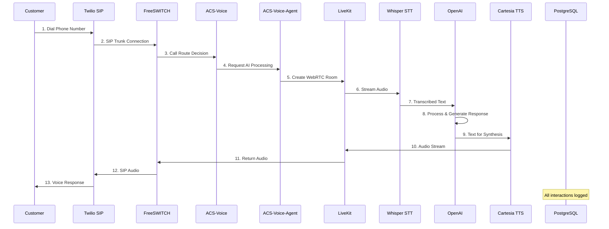

# ACS Call Processing Flow
## End-to-End Voice Communication Pipeline

## Processing Steps Detail

### Phase 1: Call Initiation (Steps 1-3)
- **Duration**: ~500ms
- **Components**: Customer Phone → Twilio → FreeSWITCH
- **Protocol**: SIP/RTP

### Phase 2: AI Setup (Steps 4-5)
- **Duration**: ~200ms
- **Components**: ACS-Voice → ACS-Voice-Agent → LiveKit
- **Protocol**: WebSocket

### Phase 3: Speech Processing (Steps 6-8)
- **Duration**: ~1-2s
- **Components**: Whisper → OpenAI
- **Protocol**: HTTPS/REST

### Phase 4: Response Generation (Steps 9-13)
- **Duration**: ~500ms
- **Components**: Cartesia → LiveKit → FreeSWITCH → Customer
- **Protocol**: WebRTC → SIP
