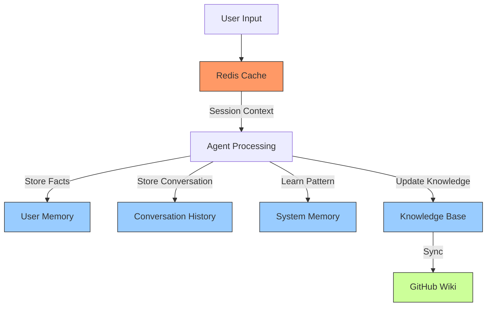

# ACS Memory Architecture
## Best Practices Implementation

---

## Overview
The ACS memory system follows industry best practices with a hybrid approach:
- **Redis/Valkey**: Short-term working memory (fast, volatile)
- **PostgreSQL**: Long-term memory (persistent, searchable)
- **GitHub Wiki**: Human-readable knowledge documentation

---

## Memory Types & Storage Locations

### 1. Working Memory (Redis/Valkey)
**Purpose:** Real-time session data
**TTL:** 1-24 hours
**Examples:**
```redis
session:abc123 = {"topic": "billing", "sentiment": "neutral"}
user:123:context = {"last_intent": "check_balance"}
agent:voice:state = {"active_call": "session_456"}
```

### 2. User Memory (PostgreSQL: user_memory)
**Purpose:** Learn about users over time
**Retention:** Permanent (with confidence decay)
**Examples:**
- Preferences: "prefers morning appointments"
- Facts: "has 3 kids", "lives in Austin"
- History: "called 5 times about billing"

### 3. System Memory (PostgreSQL: system_memory)
**Purpose:** Learn patterns and solutions
**Examples:**
- "Users asking about X usually need Y"
- "Error pattern: FreeSWITCH fails when..."
- "Successful resolution for issue type Z"

### 4. Conversation History (PostgreSQL: conversations)
**Purpose:** Complete audit trail
**All agents write here:** Unified history
**Searchable by:** user, session, intent, timestamp

### 5. Knowledge Base (PostgreSQL + GitHub Wiki)
**Database:** Structured, searchable, trackable
**GitHub Wiki:** Human-readable, versioned, collaborative

---

## Best Practices Implemented

### 1. Single Source of Truth
- ✅ One conversation table for ALL agents
- ✅ One user memory table shared by all
- ✅ Central knowledge base

### 2. No Duplication
- ✅ Each piece of data lives in ONE place
- ✅ References instead of copies
- ✅ Views for aggregated data

### 3. Performance Optimization
- ✅ Indexes on all foreign keys
- ✅ Vector indexes for semantic search
- ✅ Redis for hot data, PostgreSQL for cold

### 4. Scalability Ready
- ✅ Can split databases later by schema
- ✅ Prepared for sharding by user_id
- ✅ Vector embeddings for RAG scaling

### 5. Privacy & Compliance
- ✅ TTL on sensitive data
- ✅ Audit trail via memory_references
- ✅ User consent tracking ready

---

## Data Flow Example



---

## Knowledge Base Strategy

### Database (Primary Source)
- **Structured:** Categories, tags, metadata
- **Trackable:** Usage counts, effectiveness scores
- **Searchable:** Full-text and vector search
- **Versioned:** Track changes over time

### GitHub Wiki (Documentation)
- **Human-Readable:** Markdown format
- **Collaborative:** Team can edit
- **Versioned:** Git history
- **Public/Private:** Control access

### Sync Process
```bash
# Automated sync (cron job)
0 */6 * * * /opt/github-agents/acs-orchestrator/scripts/sync_knowledge_to_wiki.py

# Manual sync
python3 sync_knowledge_to_wiki.py
```

---

## Memory Access Patterns

### Write Patterns
1. **Immediate:** Write to Redis
2. **Batch:** Flush to PostgreSQL every 60 seconds
3. **Archive:** Move old data to cold storage

### Read Patterns
1. **Check Redis** first (cache hit)
2. **Query PostgreSQL** if not in cache
3. **Vector search** for semantic queries
4. **Load to Redis** for active sessions

---

## Migration Path to Production

### Current (Development)
- All memory tables in `acs_context_db`
- Single PostgreSQL instance
- Local Redis instance

### Production (Future)
```yaml
Databases:
  acs_memory_db:        # User & system memory
    - user_memory
    - system_memory
    - conversations
    - memory_embeddings
    
  acs_knowledge_db:     # Knowledge base
    - knowledge_base
    - learned_procedures
    
  acs_session_db:       # Session management
    - user_sessions
    - memory_references
    
Redis_Clusters:
  - session_cluster     # Geographic distribution
  - cache_cluster       # Knowledge caching
```

---

## Monitoring & Maintenance

### Key Metrics
- Memory reference frequency
- Knowledge base effectiveness
- Conversation retrieval speed
- Vector search performance

### Maintenance Tasks
- Weekly: Sync knowledge to wiki
- Monthly: Update embeddings
- Quarterly: Archive old conversations
- Yearly: Confidence decay review

---

*Architecture Version 1.0 - January 2025*
